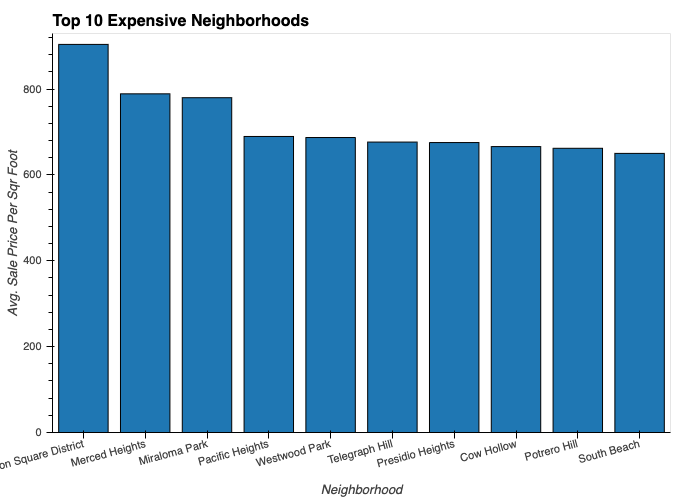
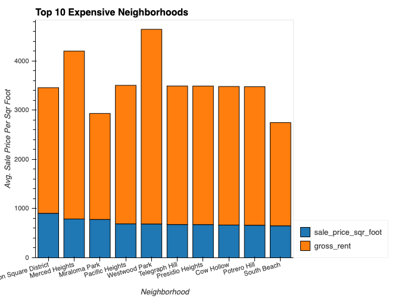

# San_Francisco_Housing_Analysis
San Francisco Housing Analysis

Analysis of San Francisco's Housing market. Created barcharts, line charts, interactive dropdowns, dashboard and parallel categories. 

Technologies used:

Python  
Pandas /n
Matplotlib /n
Plotly Express
Mapbox
Panel
PyViz
hvplot

